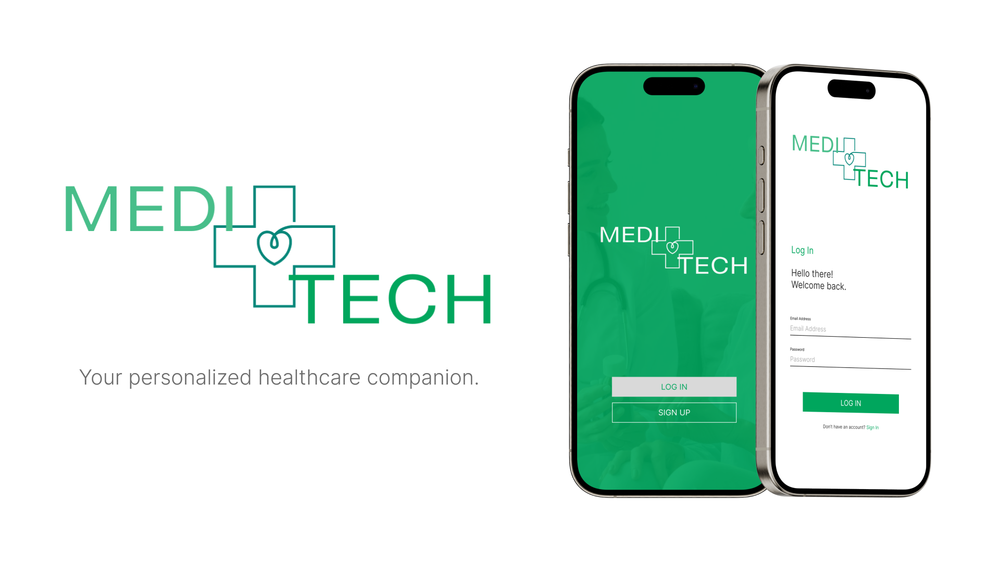

# Meditech App

An AI-driven application for auto-transcribing medicine prescriptions.



## Developed by KeyBored Warriors

- Del Rosario, Christian Ainsley
- Delos Reyes, Jerico Jr.
- Mayordo, Zherish Galvin
- Pulao, Maxine Audrey
- Rodil, Azzelle Leira

**CPE 026 - CPE41S4**

## How to run the server

1. Install requirements using `pip install -r requirements.txt`
2. Create a new file named `.env` containing the following:

   - `PYTHON_ENV`: "deployment" or "production"
   - `HOST`: host on where you want to host the server.
   - `PORT`: port on where you want the server to communicate.
   - `DB_URL`: url for the SQLite database
   - `SECRET_KEY`: secret key for JWT token, used for refresh tokens.
   - `PUBLIC_KEY`: public key for JWT token, used for access tokens.

   **For example:**

   ```
   # Server Configurations
   PYTHON_ENV="development"
   HOST="localhost"
   PORT=5000

   # Database Configurations
   DB_URL="meditech.db"

   # Jwt Configurations
   SECRET_KEY="mysecretkey"
   PUBLIC_KEY="mypublickey"
   ```
3. Run the server using `python server.py` or you can use other applications such as Docker.
